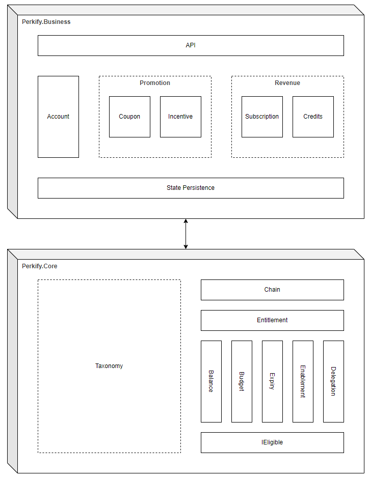

# Perkify

Perkify is a minimalist kernel written in C#, designed for the abstraction and underlying implementation of core functionalities related to various types of coupons, prepaid cards, subscription and membership.

## Architecture

The overall architecture of Perkify is designed to be modular, extensible and flexible, with a focus on the separation of concerns and the ease of integration with other systems.

]

## Features

We are currently working on the Perkify Core, which is the runtime kernel of the system:
- [x] **Eligible**: The general eligibility check interface for any specific coupon, prepaid card, subscription or membership.
- [x] **Balance**: The balance management for coupon or credits (prepaid card).
- [x] **Expiry**: The expiry management for coupon, subscription or credits (prepaid card).
- [x] **Enablement**: The enablement management for coupon, subscription or credits (prepaid card).
- [x] **Budget**: The budget management for incoming or outgoing transactions on entitlement balance.
- [x] **Delegation**: The flexible delegation-based eligiblity check for better extensibiity.
- [x] **Entitlement**: Combination of eligibility check with balance, expiry and enablement.
- [x] **Chain**: The chain of entitlements with specified order (expiry time by default).
- [ ] **Taxonomy**: Define a tags system and run eligibility check with the tags in flexible way.
- [ ] **Builder**: The builder pattern for entitlements with fluent API.

## Getting Started

### Enlistment

```bash
git clone https://github.com/perkify-net/perkify.git
```

### Build

```bash
dotnet build
```

### Test

```bash
dotnet test
```

### Submit PR for Review

```bash
git ready your-branch
git push
```

### Publish NuGet Package

```bash
git push v0.1.0
```

